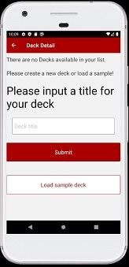
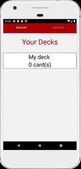
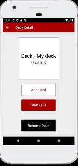
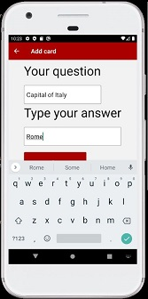
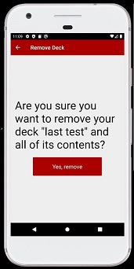
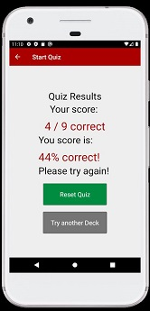

## React Native project: Mobile Flashcards mobile App
This is the third and last project in the Udacity React Nanodegree. There was no starter code in this app, just a project requirements description .

### Scope of learning: create a mobile app with React Native with Redux 
The project consisted in developing a mobile app for Android and IOs where users can create decks of cards with questions and answers, go through the deck and check the correct answer and see their score. In this webapp I have used of Redux state with Actions and Reducers, React Native Components, Navigations, Tabs and animations.

Functionalities have been developed in reusable components (see src/components) and I tested the app on Android emulator for Nexus devices (API 29).

## Project screenshots
#### Login page 
 
 







Implemented functionalities:
- List of decks
- Add and remove decks
- Add card
- Quiz
- Results
- Navigation between screens
- Feedback messages if deck does not contain cards or is empty
- load sample data

## Getting started

To create run this project, please you yarn package manager (npm seems not to work well) and install all the required software (see below):

* to create your onw app use `yarn add create-react-native-app`  OR
                         use `expo init MobileFlashcards` (works even better)
* `yarn install` to install all the dependencies included in this repo

To start the project type:
* `yarn start`  
To run your project, navigate to the directory and run one of the following yarn commands.

- cd MobileFlashcards
- yarn start # you can open iOS, Android, or web from here, or run them directly with the commands below.
- yarn android
- yarn ios # requires an iOS device or macOS for access to an iOS simulator
- yarn web


## EXTRA INSTALL
Next to React Native, please install also:

stack navigator
`yarn add @react-navigation/stack`

bottom nav
`yarn add @react-navigation/bottom-tabs`

Icons
`yarn add react-native-vector-icons`

Permissions
`expo install expo-permissions`


`yarn add @react-navigation/material-top-tabs react-native-tab-view`
https://reactnavigation.org/docs/material-top-tab-navigator/

VIEW PAGER
`yarn add @react-native-community/viewpager`
`expo install @react-native-community/viewpager`

In case you get an error message saying that the version installed is not compatible, just run 
`expo install [componenet name]`
to fix the problem.

## Folder Structure

After creation, your project should look like this:

```
my-app/
  README.md
  node_modules/
  package.json
  public/
    index.html
    favicon.ico
    images/
  src/
    actions/
      index.js
    components/
      App.js
      CreateDeck.js
      DeckDetails.js
      Feedback.js
      Quiz.js
      RemoveDeck.js
    reducers/
      index.js
    middleware/
      index.js
      logger.js
    utils/
      _Data.js
      api.js
      colors.js 
    App.js
```

For the project to build, **these files must exist with exact filenames**:

* `src/App.js` is the JavaScript entry point.


### `yarn start`

Runs the app in the development mode.<br>
Open [http://localhost:3000](http://localhost:3000) to view it in the browser or emulator.

The page will reload if you make edits.<br>

### `Testing the app in the emulators`

I have tested this project in Android Emulator.
The web interface that you can access through the Expo DevTools is not supported by the PageViewer module which is build in the Quiz component. If 
