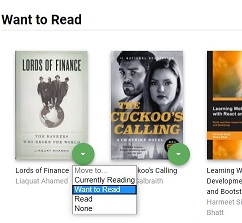
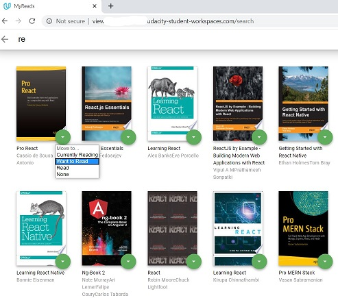

# MyReads Project

This is the first assessment project for Udacity's React Fundamentals course. The starting point was a template with static example of the CSS and HTML markup without any of the React code that is needed to complete the project. The goal is to add interactivity to the app by refactoring the static code in this template.


## Project screenshots
#### Detail page 


#### Change settings of the books


#### Search page and add books to MyReads
 

## This project code
```bash
├── README.md - This file.
├── SEARCH_TERMS.md # The whitelisted short collection of available search terms for you to use with your app.
├── package.json # npm package manager file. It's unlikely that you'll need to modify this.
├── public
│   ├── favicon.ico # React Icon, You may change if you wish.
│   └── index.html # DO NOT MODIFY
└── src
    ├── App.css # Styles for your app. Feel free to customize this as you desire.
    ├── App.js # This is the root of your app. Contains static HTML right now.
    ├── App.test.js # Used for testing. Provided with Create React App. Testing is encouraged, but not required.
    ├── BooksAPI.js # A JavaScript API for the provided Udacity backend. Instructions for the methods are below.
    ├── Shelf.js # A React component showing a shelf.
    ├── Book.js # A React component showing a single book.
    ├── Search.js # A React component showing the search page.
    ├── icons # Helpful images for your app. Use at your discretion.
    │   ├── add.svg
    │   ├── arrow-back.svg
    │   └── arrow-drop-down.svg
    ├── index.css # Global styles. You probably won't need to change anything here.
    └── index.js # You should not need to modify this file. It is used for DOM rendering only.
```

## Backend Server

The backend server is provided with file [`BooksAPI.js`](src/BooksAPI.js) contains the methods to perform necessary operations on the backend:

* [`getAll`](#getall) -  Returns a Promise which resolves to a JSON object containing a collection of book objects.
* [`update`](#update) -  Returns a Promise which resolves to a JSON object containing the response data of the POST request
* [`search`](#search) -  Returns a Promise which resolves to a JSON object containing a collection of book objects.


## Create React App

This project was bootstrapped with [Create React App](https://github.com/facebookincubator/create-react-app). You can find more information on how to perform common tasks [here](https://github.com/facebookincubator/create-react-app/blob/master/packages/react-scripts/template/README.md).

To download the start code go to: [Create React App](https://github.com/facebookincubator/create-react-app).

## TL;DR

To get started or install this project locally:


* download the project code 
* install all project dependencies with `npm install`
* start the development server with `npm start`
